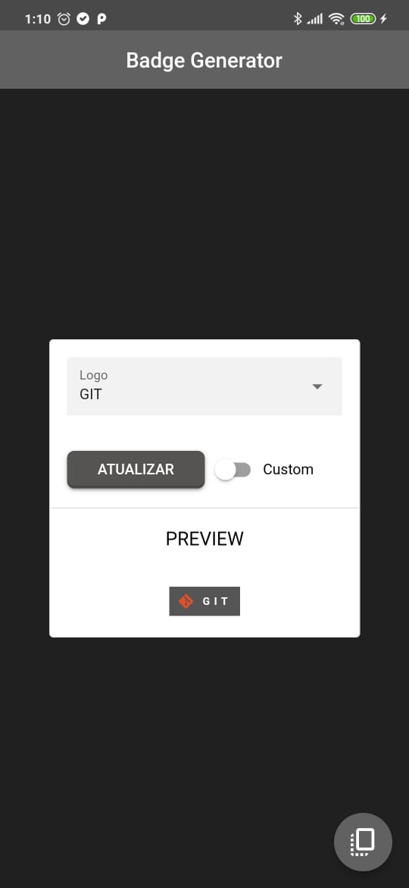
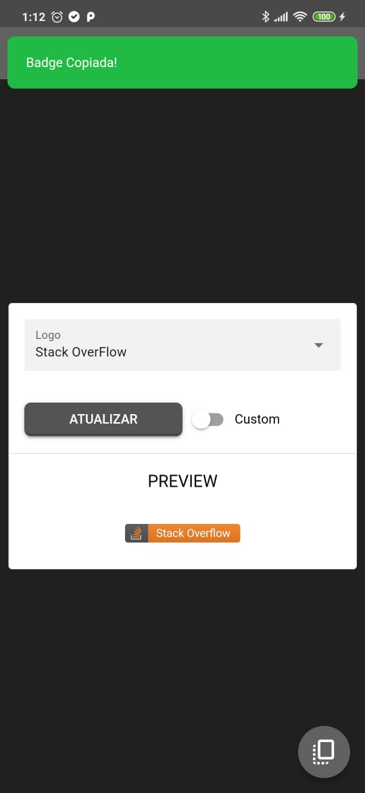

# App Badge Generator

Um app desenvolvido para criação de badges para readme de projetos e perfis do GitHub.

Crie readmes incríveis, gerando badges com as suas tecnologias favoritas para adicionar ao seu perfil do Github. Decore suas paginas iniciais dos seus projetos e as deixe mais atraentes para quem irá visitar e ler a sua apresentação.

Selecione a tecnologia e gere uma badge informativa para incrementar visualmente o readme do seu projeto, ou gere badges para serem inseridas no seu perfil no Github.

Você também pode personalizar as badges, combinando outras logos, cores e trocando o texto.

Depois de personalizar é só copiar e inserir no arquivo e pronto! :D

## Imagens

  
  

  

## Play Store

Confira meus apps publicados na  

Link para o app na loja:  

## Tecnologias utilizadas

    
    
    

## Contato

  <!--Meu Site-->
  
  <!-- Instagram -->
  
  <!-- Linkedin -->
  
  <!-- Facebook -->
  
  <!-- Twitch -->
   
  <!-- Github -->
  
  <!-- Discord -->
  
  <!-- Youtube -->
  
 
 

Obrigado!
